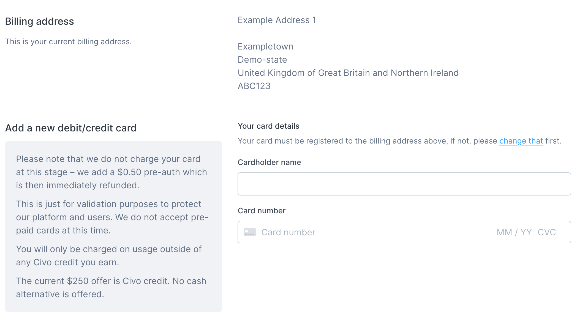

---
sidebar:
  order: 2
  label: Signing up
title: Signing up
description: Learn how to get started with Civo. Find out how to access & manage your Civo resources, incl. instances, Kubernetes clusters, and networking resources.
---

<head>
  <title>Getting Started with Civo | Civo Documentation</title>
</head>

When you [sign up](https://dashboard.civo.com/signup) to Civo, the system will require you to confirm your email address to gain access. Once you have clicked the email confirmation link, you will be able to use your selected username and password to log in to your account.

## Verifying your phone number

For account security and integrity, Civo requires you to verify your phone number. Before you are able to add a payment method or launch resources in your account, you will need to complete this process.

If you see the "We need you to verify your phone number to complete your sign-up" banner, click the "Verify your number now" link to access the service.

On this screen, choose the country your phone is registered to, and enter your mobile/cell phone number. Once completed, click the "Send verification code" button to receive a message with a one-time code.

You will be prompted to enter the code you received as a text message on the following screen:

:::note
Certain countries are not supported by the phone verification. If you see a message saying "Unfortunately we are unable to verify phone numbers in your country" this means we are unable to offer Civo services to you.
:::

## Adding a payment method

Civo services are billable. If you do not add a valid payment type to your account, you will see a banner stating you need to do so, and will not be able to create Kubernetes clusters, virtual machine instances, or the like.

You will need to add a payment method to each account. You can do this on the [billing page](https://dashboard.civo.com/billing) of your account. Valid payment methods are credit and debit cards. Civo does not support prepaid or "virtual" cards as payment types.

### Billing address

First, you will need to declare whether you're using Civo as an individual or as a business, followed with the cardholder's address details.

The address details you enter should match the billing address registered for the card you are using with your bank or financial institution, and will be used for verification.

See the Civo [Billing documentation](billing) for more information.

### Card details

Once you enter your address you will be taken to a page that lets you enter the card details. These include the cardholder name as written on the card, as well as the card number, expiry date, and security code (CVV).

Once you have entered these details, you can click "Submit" to start the card verification process. This is handled by our payment processor, Stripe.

## Account verification

If your account was successfully verified automatically, you will be taken to your dashboard with a notification stating so.

Occasionally, the verification process will not be able to validate your account automatically. In these cases, your account will remain in a pending state until manually verified by a member of Civo staff. In most cases, this wait is short, and you will receive an email as soon as your account is active.

## Introductory credit

In order for you to benefit from the introductory offer of Civo credit, your payment method (credit/debit card) used needs to be unique. In other words, two accounts using the same payment method will not be able to both benefit from introductory credit. See the Civo [Billing documentation](billing) for more information on credit balances and usage.
